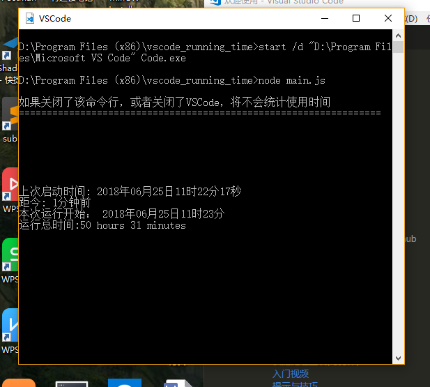

# vscode_running_time
Vscode 运行时间统计。功能参考steam的游戏时间统计。

## 使用 

点击start.bat启动VSCode，并进行使用时间的统计。
你可以给start.bat创建一个快捷方式放在桌面，代替VSCode。

## 设置
在 start.bat找到
```
start /d "D:\Program Files\Microsoft VS Code" Code.exe
```
把`"D:\Program Files\Microsoft VS Code"`替换为本机vscode的安装路径；

## 初始化时间(默认是初始的，不用管这条)
./last-launch,./total-running-time文件的内容都写成0。

./last-launch
```
0
```

./total-running-time
```
0
```